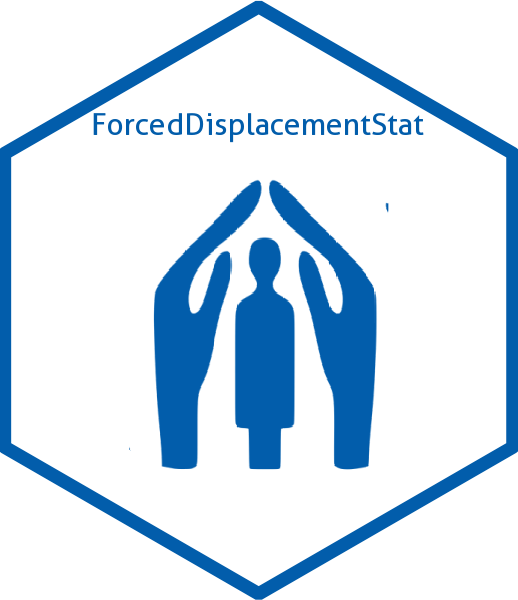

# [`{ForcedDisplacementStat}`](https://edouard-legoupil.github.io/ForcedDisplacementStat/): A data package with UNHCR Statistics Database 


The package is inspired from tutorial @ https://r-pkgs.org/data.html (the code used to build the package is in `data-raw/build.R`). Data are pulled from HDX @ [unhcr-population-data-for-world](https://data.humdata.org/dataset/unhcr-population-data-for-world) and are then conveniently packaged for R users intending to build __data stories__. Note, that you can also explore data through  [Refugee Data Finder](https://www.unhcr.org/refugee-statistics/).

> please check [`{UnhcrDataPackage}`](https://edouard-legoupil.github.io/unhcrdatapackage) to access the __chart library__


## Install

 If you are on Windows, you might first need to install [Rtools](https://cran.r-project.org/bin/windows/Rtools/) on the top of [R](https://cran.r-project.org/bin/windows/base/) and [Rstudio](https://posit.co/download/rstudio-desktop/) in order to install the package locally.

```{r}
install.packages("pak")
pak::pkg_install("edouard-legoupil/ForcedDisplacementStat")
```
 

## Data Content

The data presented in this website consists of the following dataset:

 *  [End-year population figures](reference/end_year_population_totals.html) - these are stock figures for specific types of populations at the end of each year, including refugees, IDPs and asylum seekers.
 *  [Demographics](reference/demographics.html) – are available for the UNHCR data, IDMC and UNRWA data. No demographics are available for resettlement and naturalization data
 *  [Asylum applications](reference/asylum_applications.html) by asylum-seekers
 *  [Asylum decisions](reference/asylum_decisions.html) taken on asylum claims of asylum-seekers
 *  [Solutions](reference/solutions.html) – these are flow figures, with the total number of individuals that have availed each solution in each year.
 

## Data structure

Details is provided for each dataset

All data is disaggregated by year, since 1951 for stock figures, type of population, country/territory of asylum and origin. 

> Note that the term country/territory of asylum has a range of contexts depending on the dataset chosen

 *   __Resettlement__ – in this context this is the country of arrival – i.e. the country to which a refugee has been resettled
 *   __Returns__ – in this context this is the country of departure – i.e. the country from which a refugee has voluntarily repatriated.
 
Country/territory of asylum and origin – the full list of UN countries is available on the UNSD methodology page . ISO3 country codes are included. UNHCR uses the following non-standard ISO3 country codes:  

 *   `UNK` for Various/unknown  
 *   `STA` for Stateless  

## Data protection & Statistical Disclosure Risk Treatment

Before publishing any statistics on the refugee statistics website, UNHCR applies safeguards to protect confidentiality. Small numbers less than five are rounded to the nearest multiple of five. Additionally data relating to pending asylum applications, new applications and decisions is rounded between five and ten.

Data between tables remains additive therefore the totals should be considered approximations. 

 
